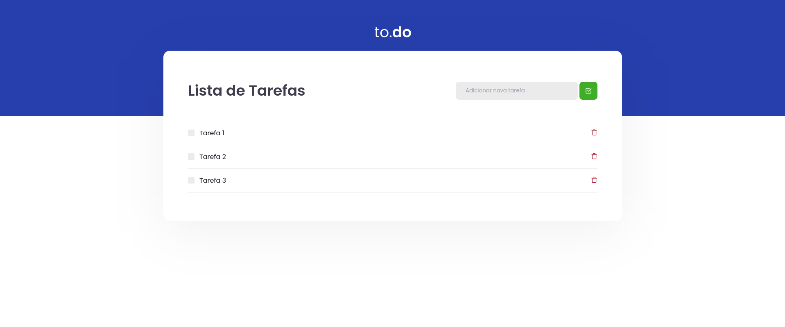

<p align="center">
  
</p>

## Tecnologias

Esse projeto foi desenvolvido com as seguintes tecnologias

- [React](https://reactjs.org)
- [TypeScript](https://www.typescriptlang.org/)

## Instruções para uso

Clone o projeto e navegue até a pasta dele

```bash
$ git clone https://github.com/oimarianinha/todo-list.git && cd todo-list
```

Siga os passos abaixo
```bash
# Instale as dependências
$ yarn

# Inicie o projeto
$ yarn dev

# Execute os testes
$ yarn test
```
## Projeto

Esse projeto foi um desafio do Ignite da [Rocketseat](https://rocketseat.com.br/) 

---
